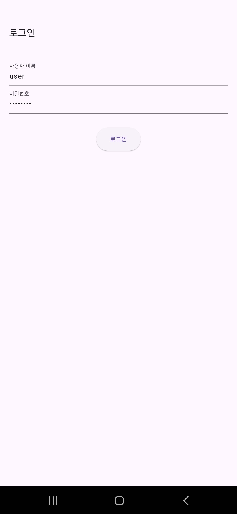
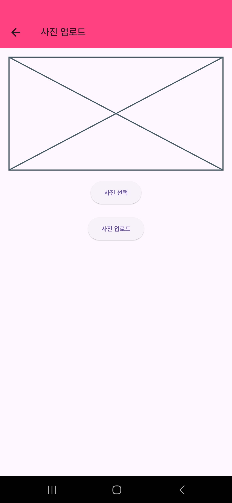

# 🐾 반려동물 미용 예약 확인 어플

## 📖 소개
**반려동물 미용 예약 확인 어플**은 반려동물 미용샵을 운영하는 사용자들을 위한 전문 스케줄 관리 및 고객 관리 앱입니다.  
플러터(Flutter)로 제작되어 다양한 플랫폼에서 동작하며, 고객 만족도와 업무 효율성을 동시에 향상시킵니다.

---

## 🎯 주요 기능
- **스케줄 관리**: 예약 현황을 직관적으로 확인하고 관리.
- **고객 관리**: 기존 고객의 미용 내역, 선호도 및 고객 정보를 체계적으로 기록 및 검색.
- **매출 관리**: 일별, 월별 매출 통계 및 분석 제공.
- **이미지 저장**: 고객 및 반려동물 사진을 안전하게 저장 및 관리.

---

## 🔧 기술 스택 및 개발 환경

### 📱 클라이언트
- **Flutter**: 크로스 플랫폼 앱 개발 프레임워크.
- **Dart**: Flutter에서 사용되는 언어, 선언적 UI 작성에 최적화.
- **Android Studio**: 클라이언트 개발 환경.
- **Gradle**: 프로젝트 의존성 관리.
  - **이미지 피커(Image Picker)**: 사진 선택 및 카메라 사용 라이브러리.

### 🌐 백엔드
- **Spring Boot**: REST API 설계 및 구현.
- **Postman**: API 테스트 및 문서화.
- **Spring Security**: JWT를 이용한 인증 및 보안.

### 📂 데이터베이스 및 인프라
- **Oracle Autonomous Transaction Processing (ATP)**: 클라우드 기반 데이터베이스.
- **Oracle OCI (Object Storage)**: 고객 및 반려동물 사진 등 파일 저장.
- **Git/GitHub**: 버전 관리 및 협업.

### 🔒 보안
- **JWT (JSON Web Token)**: 사용자 인증 및 권한 관리.
- **Spring Security**: API 보호 및 인증 처리.

### 🛠️ 기타
- **카카오톡 API**: 예약 알림 및 메시지 전송 기능 구현.

---

## 📸 실행 화면

### 1. **로그인 화면**  

---

### 2. **메인 화면**  
검색어 입력 창과 고객의 반려동물 등록, 예약 잡기, 검색하기, 캘린더 보기, 매출 계산 등의 목록을 보여줍니다.  
하단의 네비게이션 바를 통해 메뉴 이동이 편리합니다.  

---

### 3. **반려동물 등록 화면**  
이름, 품종, 연락처를 간단히 등록할 수 있는 화면입니다.  

---

### 4. **예약 추가 화면**  
고객의 번호 또는 반려동물 이름을 입력하면 아래에 리스트가 표시됩니다.  
- 반려동물 이름, 연락처, 품종으로 고객을 확인할 수 있습니다.  
- 선택 시 정보가 자동으로 입력됩니다.  

---

### 5. **검색 화면**  

---

### 6. **검색 기능 상세**  
번호를 입력하면 연락처가, 한글 입력 시 반려동물 이름이 검색됩니다.  
특히, 한 반려동물에 여러 견주가 있을 경우 추가된 연락처도 검색됩니다.  

---

### 7. **반려동물 상세정보 화면**  
이름, 품종, 무게, 연락처, 노쇼 횟수, 방문했던 미용 기록 등을 확인할 수 있습니다.  

---

### 7-1. **미용 기록 상세**  
미용 기록을 클릭하면 미용 사진을 확대해 볼 수 있으며,  
미용 방식과 추가 메모를 확인할 수 있습니다.  

---

### 8. **캘린더 화면**  
- 날짜를 터치하면 해당 날짜의 미용 기록을 확인할 수 있습니다.  
- 미용 방식이나 원하는 색상을 선택해 기록을 확인하기 쉽게 표시합니다.  

---

### 9. **미용 상세보기**  
각 미용 기록을 클릭하면,  
그날의 미용 사진, 스타일, 추가 메모를 확인할 수 있습니다.  
- 자주 변경하거나 추가하는 메모는 바로 수정할 수 있습니다.  

---

### 10. **색상 변경**  
미용 색상은 바로 변경 가능하도록 설정하였습니다.  

---

### 11. **사진 등록 요청**  
미용 사진이 등록되지 않은 경우 사진 등록 요청 화면이 표시됩니다.  

---

### 12-13. **이미지 선택 및 업로드**  
이미지 피커를 통해 사진을 선택하여 Oracle Cloud Bucket에 업로드됩니다.  

  
  

---

### 14. **매출 확인 화면**  
원하는 일시의 매출을 바로 확인할 수 있습니다.  

